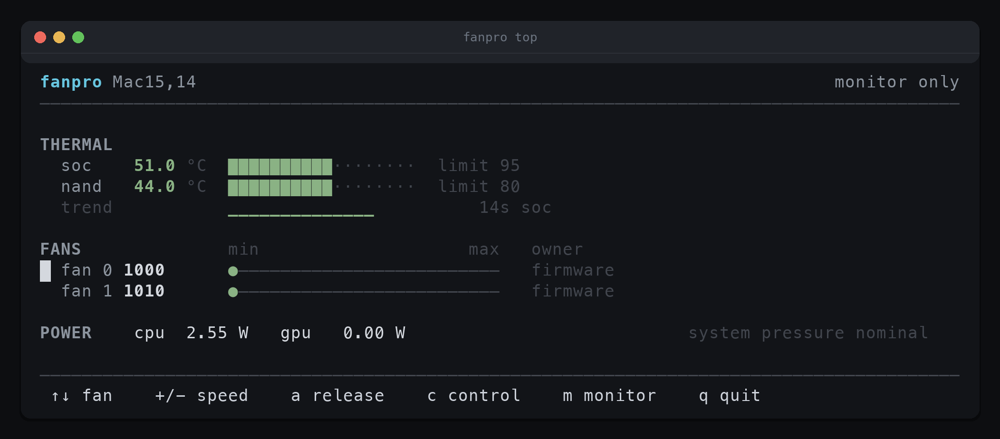
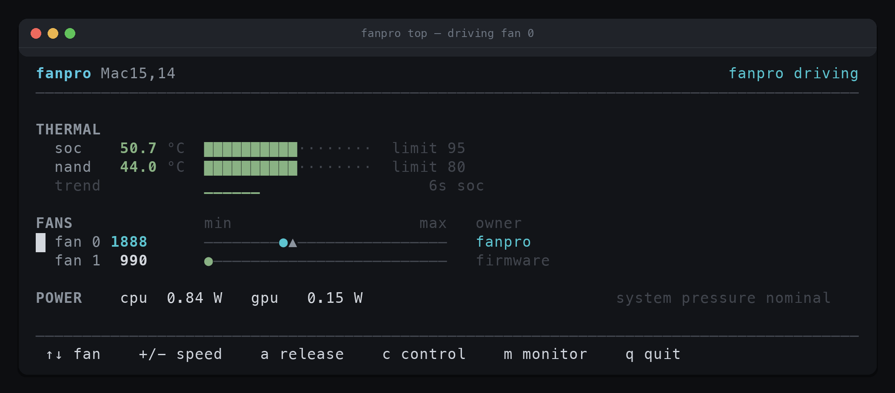

# fanpro

Fan control and thermal monitoring for Apple Silicon Macs. A command-line tool, a live terminal dashboard, and a root daemon. Written in C with no dependencies beyond what macOS ships.



Monitoring works as an ordinary user with nothing installed. Driving the fans needs the daemon, and is off by default.

---

## Read this before enabling fan control

**On Apple Silicon, the firmware does not override a fan held in manual mode.**

This was measured, not assumed. On a Mac Studio M3 Ultra under a 144 W load, a fan commanded to 1000 RPM stayed at 1021 RPM while the SoC reached 72 °C and the fan still under firmware control ramped to 2519 RPM. Zero of 390 samples showed the firmware intervening. The raw trace is in [`data/06082026_thermal_authority.log`](data/06082026_thermal_authority.log) and the analysis is in [`docs/engineering-log.md`](docs/engineering-log.md).

The consequence is simple and important: **while fanpro holds a fan, fanpro is the only thermal protection that fan has.** Manual control does not mean "the fan does what I ask" — it means that fan has left the system's thermal management.

Because custody matters this much, the dashboard is built around it. Each fan gets a track across its real range: `●` is where the fan actually is, `▲` is where it has been told to go, and the owner column says who is responsible for it. Cyan means fanpro is driving that fan and is the only thing protecting it. Grey means the firmware still has it.



Above, fan 0 is climbing toward a commanded 1900 RPM under fanpro's control while fan 1 sits at its minimum under the firmware's.

That is why:

- fanpro ships in **monitor-only mode**. It will not touch a fan until you deliberately enable curve mode.
- The default curve is **derived from the firmware's own measured response** and sits at or above it at every temperature, so enabling fanpro never makes your machine run hotter than leaving it alone.
- Every code path that loses confidence — a stale sensor, a wedged loop, an unclean exit, another tool competing for the fans — **releases the fans back to the firmware** rather than carrying on.

This measurement is from one machine. It is very likely to hold across Apple Silicon, but fanpro cannot promise that for hardware nobody has tested. `fanpro smc hold` will tell you what your Mac does.

You are still driving your own hardware. Use `fanpro smc probe` first, keep the conservative defaults unless you have a reason not to, and do not set a fan below what the firmware would have chosen at that temperature.

---

## Features

**Monitoring** — no daemon, no root, no installation beyond the binary:

- Every temperature sensor, grouped by class (SoC, GPU, NAND, ambient, power)
- Fan RPM, min/max limits, target and control mode
- CPU and GPU power draw
- SSD temperature
- Full SMC key dump with types and raw bytes, for anyone poking at this hardware
- `fanpro top`, a live dashboard showing fan custody, thermal headroom and trend

**Control** — needs the daemon and admin rights:

- Temperature-to-RPM curves with hysteresis and asymmetric ramping (fast up, slow down)
- Manual per-fan speeds
- Per-sensor-class panic thresholds
- JSONL history with daily rotation, plus CSV export
- Threshold alerts with hysteresis and macOS notifications

## Requirements

- Apple Silicon Mac. Intel is unsupported: the code has an Intel encoding path but it has never run on Intel hardware.
- macOS 26 (Tahoe) or later is what this is developed and tested against. Earlier versions probably work — the code probes rather than assumes — but are untested.
- Xcode command line tools. Nothing else: no Homebrew packages, no package manager, no external libraries.

### Hardware support

| Machine | Status |
|---|---|
| Mac Studio M3 Ultra (`Mac15,14`), macOS 26.3 | **Verified** end to end, including fan control |
| Other Apple Silicon with fans | Expected to work. fanpro probes for the mode key spelling and the `Ftst` unlock rather than assuming a model |
| Fanless Macs (MacBook Air, some minis) | Monitoring works; there is nothing to control |
| Intel Macs | Not supported |

Run `sudo fanpro smc probe` on your machine. It reports which control path your firmware needs, proves it by driving a fan, and releases it again.

## Installation

```bash
git clone https://github.com/omar16100/fanpro.git
cd fanpro
make
sudo make install
```

That installs `fanpro` to `/usr/local/bin` and `fanprod` to `/usr/local/sbin`, and copies the example config to `/etc/fanpro/fanpro.conf` if you do not already have one.

Monitoring works immediately. For fan control, install the daemon:

```bash
sudo fanpro daemon install
```

This writes a launchd plist to `/Library/LaunchDaemons` and starts `fanprod`. **No code signing, entitlement or TCC grant is required** — the SMC enforces write permission against uid, not code identity.

To remove it completely:

```bash
sudo fanpro daemon uninstall
sudo make uninstall
```

## Quick start

```bash
# 1. Look before you touch anything.
fanpro fans
fanpro sensors
fanpro top

# 2. Find out what your Mac's firmware actually allows.
sudo fanpro smc probe

# 3. Only if you want fanpro to drive the fans:
sudo fanpro daemon install
sudo vi /etc/fanpro/fanpro.conf     # set mode = curve
sudo fanpro daemon reload
```

## Commands

### Monitoring

```
fanpro fans                     per-fan rpm, limits, mode, target
fanpro sensors [--json] [--all] temperature sensors, grouped by class
fanpro power                    CPU/GPU watts
fanpro disk                     SSD temperature and health
fanpro smc dump                 every SMC key with type and value
fanpro smc get <key>            one key
fanpro top                      live dashboard
```

`fanpro top` works with or without the daemon. Without it, everything is read-only and the owner column reads `firmware` throughout. Hotkeys go through the same IPC path as the CLI, so the dashboard holds no privileges of its own. It uses Unicode box glyphs where the terminal supports them and falls back to ASCII where it does not.

```
$ fanpro power
channel                                     watts
CPU                                          1.57
GPU                                        140.80

total                                      142.36
```

```
$ fanpro disk
SMART counters: unsupported by this NVMe controller.

temperature       44.0 C  (from thermal sensor)
```

`fanpro sensors` reports 77 sensors on a Mac Studio M3 Ultra. Names are machine-specific and FourCC-derived, so fanpro enumerates and classifies by pattern rather than hardcoding them. Duplicates across dies are kept and disambiguated (`PMU tdie1`, `PMU tdie1#2`) because they read differently and all of them are real.

### Control

```
fanpro status                   daemon, fan and sensor state
fanpro set <fan N|all> <rpm|auto>
fanpro mode <auto|curve>        monitor only, or drive the fans
fanpro daemon status|install|uninstall|reload|enable|release
fanpro log tail [lines]         recent daemon log
fanpro history [n|--csv]        recorded samples
```

```
$ fanpro status
mode        curve
uptime      757 s
power       CPU 0.45 W, GPU 134.00 W

fan       rpm      min      max  mode    held   curve
0        3699     1000     3625  manual  yes    -
1        3586     1000     3625  manual  yes    -

soc          68.6 C
nand         44.0 C
power        67.7 C
```

Manual overrides from `fanpro set` are **volatile by design**: they do not survive a daemon restart. Persistence belongs in the config file, and the CLI says so every time.

### Diagnostics

```
sudo fanpro smc probe [--fan N] [--rpm N]
```

Works out how manual fan control behaves on your Mac. Tries a direct mode write, falls back to the `Ftst` unlock if the firmware refuses, drives one fan to a modest speed, verifies the RPM actually moves, then releases. Always releases, including on Ctrl-C.

```
sudo fanpro smc hold [--fan N] [--rpm N] [--seconds N] [--load N]
```

The experiment behind the safety notice above. Pins one fan, applies an all-core load, and reports whether the firmware overrides it. **This deliberately makes your machine hot.** It aborts in code at 95 °C, at heavy thermal pressure, or on any signal, and refuses to give a verdict when the data cannot support one.

## Configuration

`/etc/fanpro/fanpro.conf`. Reload with `sudo fanpro daemon reload` or `SIGHUP`.

Parsing is strict and all-or-nothing: an unknown key, a malformed curve point, or a fan bound to a curve that does not exist fails the whole file with a line number, and the running daemon keeps its previous settings. A typo must never silently leave a fan on a curve nobody chose.

### `[general]`

| Key | Default | Meaning |
|---|---|---|
| `mode` | `auto` | `auto` monitors only. `curve` drives the fans |
| `log_level` | `info` | `error`, `warn`, `info`, `debug`, `trace` |
| `panic_soc_c` | `95` | SoC over this → fan to maximum |
| `panic_gpu_c` | `95` | |
| `panic_nand_c` | `80` | NAND throttles far below the SoC |
| `panic_ambient_c` | `70` | |
| `allow_fan_stop` | `false` | The firmware permits a stopped fan. fanpro does not, unless you say so |
| `max_sample_failures` | `3` | Consecutive failed sensor samples before releasing the fans |
| `tick_ms` | `1000` | Control loop interval |
| `deadband_rpm` | `25` | Do not rewrite the target for changes smaller than this |
| `heartbeat_timeout_s` | `10` | Seconds without a control-loop heartbeat before forcing a release |

Sensor classes with no panic threshold set are ignored by the panic check. `other` is deliberately unset: on this machine the SMC `T*` space reports an opaque key at 96 °C while every die sensor reads 49 °C, and panicking on that would mean permanently full-speed fans.

### `[fan.N]`

```ini
[fan.0]
curve = safe
```

Binding is explicit. A fan with no curve is left on auto, and never inherits one.

### `[curve.NAME]`

```ini
[curve.safe]
source = class:soc
points = 50:1000, 55:1200, 60:1300, 64:1500, 67:1900, 70:2400, 73:2900, 78:max
hysteresis_c = 2
slew_up_rpm = 400
slew_down_rpm = 100
spike_temp_c = 85
```

| Key | Meaning |
|---|---|
| `source` | `class:soc\|gpu\|nand\|ambient\|power`, or `match:SUBSTRING` for sensors by name |
| `aggregate` | `max` (default) or `avg`, for `match:` sources. A class is always judged by its hottest member |
| `points` | `temp:rpm` pairs, strictly increasing in temperature. `max` means this fan's maximum |
| `hysteresis_c` | Applied **downward only**. A rising temperature always gets an immediate response |
| `slew_up_rpm` | Maximum increase per tick |
| `slew_down_rpm` | Maximum decrease per tick. Deliberately smaller than up: ramping down slowly is comfort, ramping up slowly is a thermal risk |
| `spike_temp_c` | At or above this, the upward limit is bypassed entirely |

Below the first point and above the last, the curve holds flat rather than extrapolating.

**The shipped `safe` curve is not invented.** It is derived from the firmware's own measured response, with margin at every point:

| SoC | Firmware | `safe` |
|---|---|---|
| 55 °C | ~1130 | 1200 |
| 64 °C | ~1374 | 1500 |
| 67 °C | ~1782 | 1900 |
| 70 °C | ~2298 | 2400 |

### `[alert.NAME]`

```ini
[alert.hot_soc]
source = class:soc
above_c = 85
notify = true
```

Alerts fire once on crossing, repeat at most every five minutes while still over, and re-arm only after falling 3 °C clear. An alert that fires every second is one nobody reads.

## How it works

Three artifacts over one static library:

| | Runs as | Responsibility |
|---|---|---|
| `fanpro` | you | CLI and TUI. Reads sensors directly. Sends every mutation to the daemon |
| `fanprod` | root, under launchd | Sole owner of SMC writes. Control loop, curves, safety gate, watchdogs, history, alerts |
| `libfanpro.a` | both | SMC transport and codecs, sensor providers, curve and safety logic, config, IPC |

**No SMC write happens outside `fanprod`.** The CLI never opens a write path, which is why it is safe to run as a normal user.

### Data sources

| Data | Source |
|---|---|
| Fans | SMC keys `FNum`, `F%dAc/Mn/Mx/Tg`, and `F%dMd` or `F%dmd`, via the `AppleSMC` IOKit user client |
| Temperatures | `IOHIDEventSystemClient`, matching the Apple vendor usage page. SMC `T*` keys are a fallback only |
| Power | `IOReport`, loaded with `dlopen` so a rename costs the watt readings and nothing else |
| Thermal pressure | `notify_get_state` on `com.apple.system.thermalpressurelevel` |
| SSD | `IONVMeSMARTUserClient`, with the HID NAND sensor as fallback |

All of these are private API. Everything is probed at runtime and degrades independently: a subsystem that disappears becomes "unavailable", never a crash. See [`docs/smc_reference.md`](docs/smc_reference.md) for the wire protocol, key types, result codes and per-generation behaviour.

### Privilege model

`fanprod` listens on `/var/run/fanpro.sock`, `root:admin`, mode `0660`. The CLI speaks a fixed binary protocol — not JSON, because a hand-rolled parser in a root daemon reading local user input is a poor trade for ten verbs. The daemon authenticates the peer with `LOCAL_PEERCRED`: reads are open to any identified peer, mutations need uid 0 or the `admin` group.

## Safety design

Every proposed fan target passes through one gate, `fanpro_safety_check`. There is no second path.

- **Clamped** to the fan's own reported min/max, with a hard floor at minimum unless `allow_fan_stop` is set.
- **Per-class panic thresholds.** One global number is wrong in both directions: 95 °C is unremarkable on SoC die and dangerous on NAND. A panic drives the fan to maximum and *holds* it there until the temperature is comfortably clear.
- **An independent signal.** macOS thermal pressure is consulted alongside fanpro's own sampling, so a silently broken sensor path cannot make the machine look cool.
- **NaN means no opinion.** A curve with no usable reading releases the fan. Inventing a number there would be the most dangerous thing the gate could do.

Around that:

- **Heartbeat watchdog.** `launchd` only restarts on process exit, so a deadlocked daemon would hold fans at a stale target forever. A separate thread demands proof of life and raises a release flag. It never touches the SMC itself — the control loop is the sole owner, which removes the race rather than guarding it.
- **Crash-loop latch.** After an unclean exit, the daemon recovers the fans and then **stays in monitor-only** until you run `fanpro daemon enable`. Without it, a crashing daemon would be restarted by launchd and re-pin the fans every time.
- **Startup recovery.** Any fan found in manual mode from a previous run is forced back to auto before anything else happens. On hardware with no `Ftst`, nothing else ever will.
- **Drift detection.** If another fan-control tool moves a mode key or rewrites a target, fanpro stands down rather than fighting, and latches out entirely if it keeps happening.
- **Release on everything.** `SIGTERM`, `SIGINT`, `atexit`, heartbeat timeout, sleep, power-off, sensor staleness, panic, drift.

## Known limitations

- **No NVMe SMART counters.** Apple's internal `AppleANS3CGv2Controller` returns `kIOReturnUnsupported`; root does not help. Temperature falls back to the HID sensor.
- **No ANE power.** Not exposed as an aggregate in this machine's Energy Model group.
- **The `Ftst` unlock path is untested on real hardware.** The development machine has no such key. It is covered by tests against a fake firmware only.
- **Intel is untested.** The `fpe2` encoding path exists and is unit-tested, but has never run on an Intel Mac.
- **No GUI or menu bar.** This is a CLI, a TUI and a daemon, by design.
- **One tool at a time.** The SMC allows a single controller. Running fanpro alongside another fan utility will make them fight; fanpro detects this and stands down.

## Troubleshooting

**`fanprod is not running`** — install it with `sudo fanpro daemon install`, or check `sudo launchctl list | grep fanpro`.

**`permission denied`** — mutations need the `admin` group or `sudo`. Monitoring commands never do.

**`fanprod is in monitor-only mode, so this would have no effect`** — working as intended. Set `mode = curve` in the config and reload. fanpro refuses rather than accepting a command it would silently ignore.

**`LATCHED`** — the previous run exited uncleanly, or another tool kept taking the fans. fanpro has deliberately stopped controlling them. Check `fanpro log tail`, then `sudo fanpro daemon enable`.

**Fans not responding to `set`** — run `sudo fanpro smc probe`. Your firmware may not permit manual control at all, which the probe will say plainly.

## Development

```bash
make          # fanpro + fanprod
make test     # unit tests, no hardware or root needed, well under a second
make check-live   # read-only checks against real hardware
```

```
src/smc/       transport, type codecs, IOKit backend, in-memory fake
src/sensors/   HID temperatures, SMC fallback, IOReport power, NVMe, registry
src/fan/       curve evaluation, the safety gate, the unlock state machine
src/daemon/    control loop, heartbeat, IPC server, power notifications
src/cli/       subcommands and the IPC client
src/tui/       the dashboard
tests/         ~3600 assertions, no external test framework
```

The control plane is fully testable without hardware because the SMC backend, the clock and the sensor sampler are all injectable. The fake firmware models the behaviours that actually bite: typed keys, absent keys answering `0x84`, mode-3 rejection with `0x82`, the `Ftst` yield delay on a virtual clock, and clearing `Ftst` taking every manual fan with it.

Style: kernel-ish C, tabs, snake_case, files well under 2000 lines. Comments explain *why*, especially where a plausible-looking simplification would be unsafe.

## Contributing

See [`CONTRIBUTING.md`](CONTRIBUTING.md). Reports from Macs other than a Mac Studio M3 Ultra are especially valuable — please include the output of `sudo fanpro smc probe` and your `sysctl -n hw.model`.

## Licence

MIT. See [`LICENSE`](LICENSE).

## Acknowledgements

This project would have been considerably harder without prior reverse-engineering work published by others:

- [agoodkind/macos-smc-fan](https://github.com/agoodkind/macos-smc-fan) — the `Ftst` unlock mechanism, `SMCKeyData` layout, SMC result codes, and per-generation behaviour
- [hholtmann/smcFanControl](https://github.com/hholtmann/smcFanControl) — the original SMC protocol implementation that everything in this space descends from
- [fermion-star/apple_sensors](https://github.com/fermion-star/apple_sensors) and [btop](https://github.com/aristocratos/btop) — `IOHIDEventSystemClient` temperature enumeration
- [smartmontools](https://github.com/smartmontools/smartmontools) — macOS NVMe SMART access
